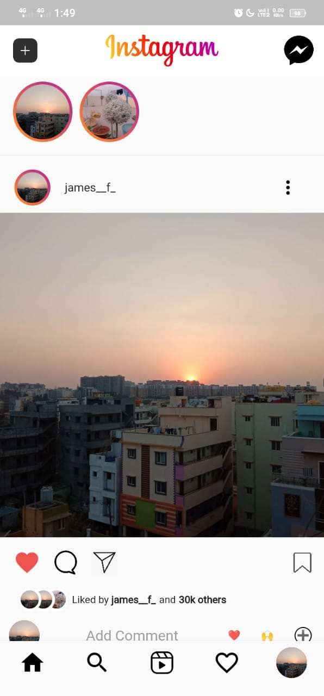

# **Instagram UI Clone**
#### Using Flutter


### Steps
- ```git clone https://github.com/j-amesfrancis/instagram_ui.git```
- ```cd instagram_ui```
- ```flutter run```


### ScreenShots



- [Follow on Insta](https://www.instagram.com/james__f_/)
